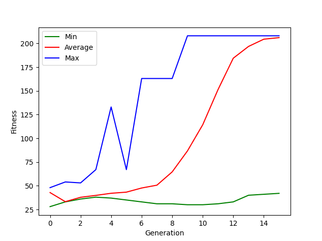

# Snail jumper
**Neuroevolution game assignment.**  
**Spring 2022 - Computational Intelligence.**  

This game has been developed as an assignment for students at Amirkabir University of Technology to apply neuroevolution using a simple game.  

## Learning curve example

  

## Contributors
[Soroush Mehraban](https://github.com/SoroushMehraban)

Implementation of the neural network and the evolutionary algorithm is by me.
